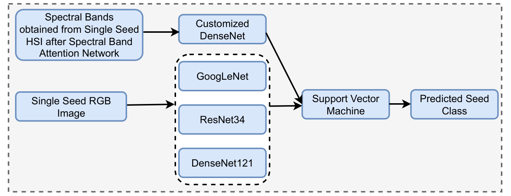
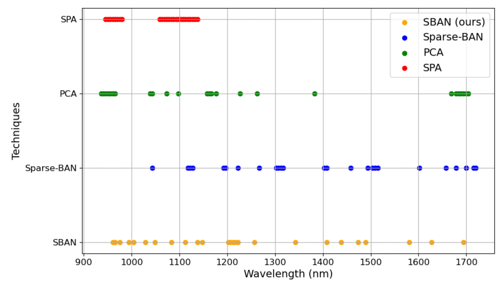
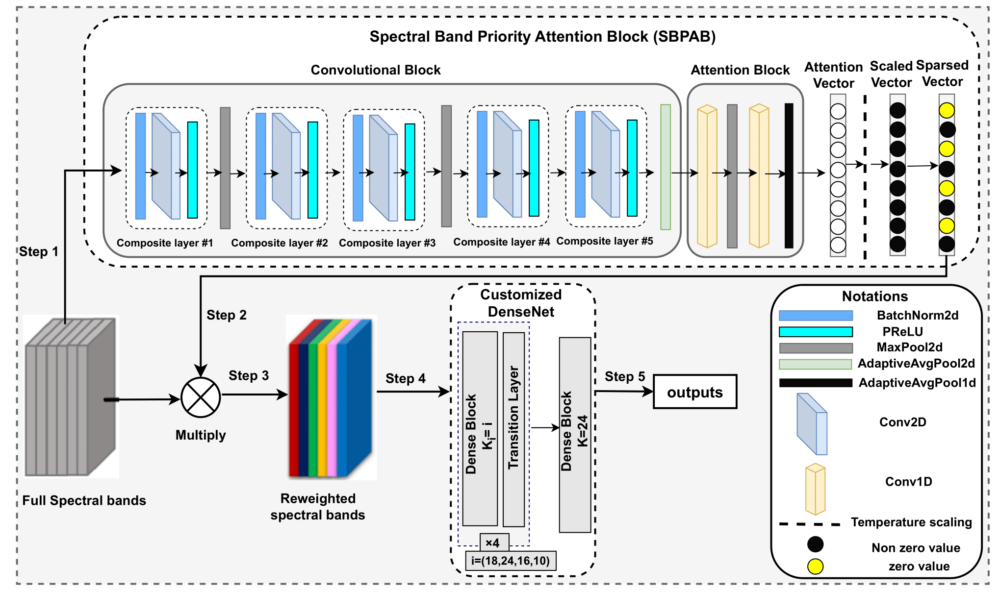
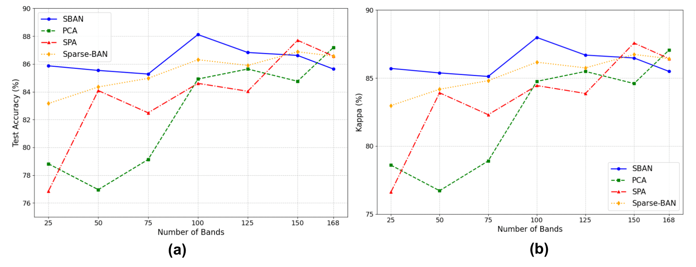

# **Spectral Band Attention Networks for Efficient Multi-Feature Fusion in Hyperspectral and RGB Data with Ensemble Deep Learning Networks**

#### Overview  
This project presents a **dual-branch network** integrating hyperspectral imaging (HSI) and RGB data for accurate wheat seed classification. The network leverages the most informative spectral bands using a novel **Spectral Band Attention Network (SBAN)** and fine-tuned RGB models to achieve robust multi-modal feature fusion.


<div align="center">
  <figure>
    
    <figcaption>Figure 1: Dataset overview</figcaption>
  </figure>
</div>

---

#### Key Components  

1. **Model Architecture**  
   - **Dual-Branch Network:**  
     - **Branch 1 (HyperSpectral Data):** Customized DenseNet model trained on selected spectral bands using SBAN.  
     - **Branch 2 (RGB Data):** Fine-tuned deep convolutional models (DenseNet121, ResNet34, GoogLeNet) for feature extraction from RGB images.  
   - **Classifier:** A Support Vector Machine (SVM) combines the outputs of both branches for final wheat seed class prediction.

<div align="center">
  <figure>
    
    <figcaption>Figure 2: Model Architecture Setup</figcaption>
  </figure>
</div>

---

2. **Spectral Band Selection Methodologies**  
[Selecting most useful bands](models/hsi/band_selection) out of a total collection of 168, contributing to the overall objective of seed classification
   - **Successive Projections Algorithm (SPA)**  
   - **PCA-loading (Principal Component Analysis)**  
   - **Sparse BAN**
   - **SBAN (ours)**

<div align="center">
  <figure>
    
    <figcaption>Figure 3: Band Selection Weights (top 25)</figcaption>
  </figure>
</div>

---
#### **Proposed SBAN Architecture Setup**
The figure illustrates the **Spectral Band Priority Attention Block (SBPAB)** integrated into a dual-branch customized DenseNet architecture for hyperspectral data processing.  

1. **SBPAB Module**:  
   - Input: Full spectral bands.  
   - A series of convolutional and attention blocks generates a scaled sparse attention vector, highlighting important spectral bands.  

2. **Band Reweighting**:  
   - The attention vector is multiplied with the input spectral bands to produce reweighted bands.  

3. **DenseNet Integration**:  
   - The reweighted bands are fed into a customized DenseNet, consisting of dense blocks and transition layers.  

4. **Output Generation**:  
   - The final dense block processes the features, leading to the classification output.

<div align="center">
  <figure>
    
    <figcaption>Figure 4: SBPAB workflow with customized DenseNet for hyperspectral feature extraction and classification</figcaption>
  </figure>
</div>

---

#### Evaluation  

The performance of the dual-branch network was systematically compared by:  
- Varying the number of spectral bands selected.  
- Comparing SBAN-based selection with SPA and PCA-loading and Sparse-BAN

<div align="center">
  <figure>
    
    <figcaption>Figure 5: Performance with varying bands</figcaption>
  </figure>
</div>

---

#### Setup Instructions : 
   - Create a new poetry project : ```poetry install```
   - Run [env_activation bash](activate.sh) file.
   - It will install all necessary packages for the first run.
   
---


#### Citation  

If you use this work, please cite:  
> [Provide citation details here]
